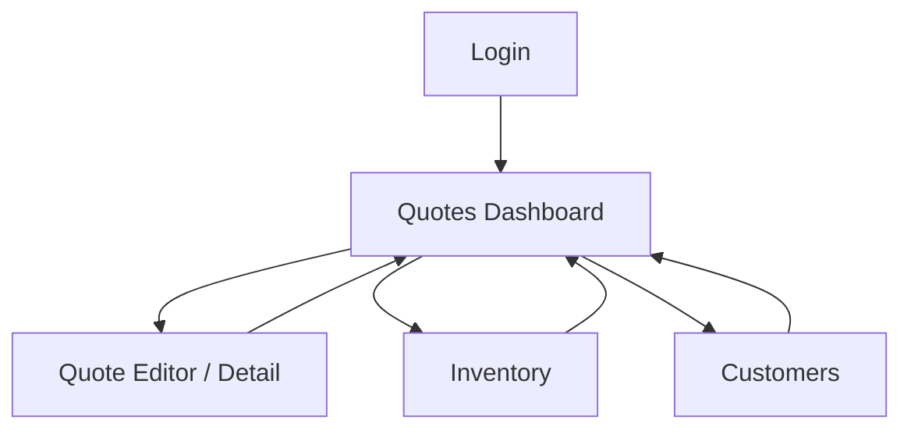

## 1. Product Overview
A Quasar (Vue) web app for creating, managing, and exporting quotations.
Supabase is connected for authentication, data storage, and optional PDF file storage.
Users can only add items by selecting products from inventory (no manual product entry) and the system enforces stock warning rules.

## 2. Core Features

### 2.1 User Roles
| Role | Registration Method | Core Permissions |
|------|---------------------|------------------|
| Sales User | Admin creates user / invites by email | Create and edit quotes, export PDF, change quote status within rules |
| Admin | Admin creates first admin, then invites | Manage inventory/products, manage customers, manage users, configure stock warning rules |

### 2.2 Feature Module
Our quotation system consists of the following main pages:
1. **Login**: sign-in, password reset.
2. **Quotes Dashboard**: quotes list, filters, create quote.
3. **Quote Editor / Detail**: customer selection, inventory product picker, line items, totals, status changes, stock warnings, PDF export.
4. **Inventory**: product list, create/edit products, stock on hand maintenance.
5. **Customers**: customer list, create/edit customers.

### 2.3 Page Details
| Page Name | Module Name | Feature description |
|-----------|-------------|---------------------|
| Login | Authentication | Sign in with email/password; request password reset email |
| Quotes Dashboard | Quotes list | View quotes with status, customer, total, updated time; filter by status/date/search; open quote |
| Quotes Dashboard | Create quote | Create new draft quote; navigate to Quote Editor |
| Quote Editor / Detail | Customer | Select existing customer; display customer address/contact on quote |
| Quote Editor / Detail | Inventory-only item add | Search/select product from inventory; set quantity; disallow manual product name/price entry |
| Quote Editor / Detail | Pricing & totals | Compute line totals and grand total from inventory unit price; show taxes/discount only if configured (optional) |
| Quote Editor / Detail | Status management | Change status (Draft → Sent → Accepted/Rejected/Expired); log status timestamp |
| Quote Editor / Detail | Stock warning rules | Validate each line qty against available stock; show warning message; block status change to Sent (and PDF “final export”) when rule fails |
| Quote Editor / Detail | PDF export | Export quote to PDF including status label and line items; download locally and/or attach to quote record |
| Inventory | Product catalog | View/search products; create/edit product (SKU, name, unit price, active flag); maintain stock on hand |
| Customers | Customer directory | View/search customers; create/edit customer details for use in quotes |

## 3. Core Process
**Sales User Flow**
1. Sign in.
2. Open Quotes Dashboard and create a new quote (Draft).
3. In Quote Editor: choose a customer, then add items only via the inventory picker and set quantities.
4. Review totals and resolve any stock warnings.
5. Export PDF for review (Draft) or change status to Sent (system blocks if stock rule fails).
6. Update status to Accepted/Rejected/Expired as the deal progresses; export PDF reflecting the current status.

**Admin Flow**
1. Sign in.
2. Maintain Inventory (products and stock on hand) so Sales can quote only from available items.
3. Maintain Customers.
4. Configure the stock warning rule behavior (e.g., warn vs block on “qty > available”).

