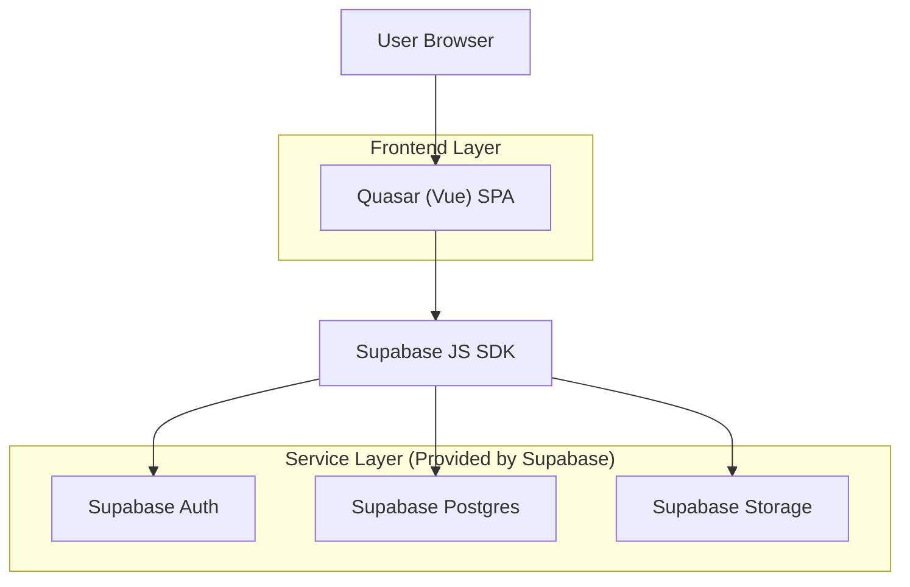
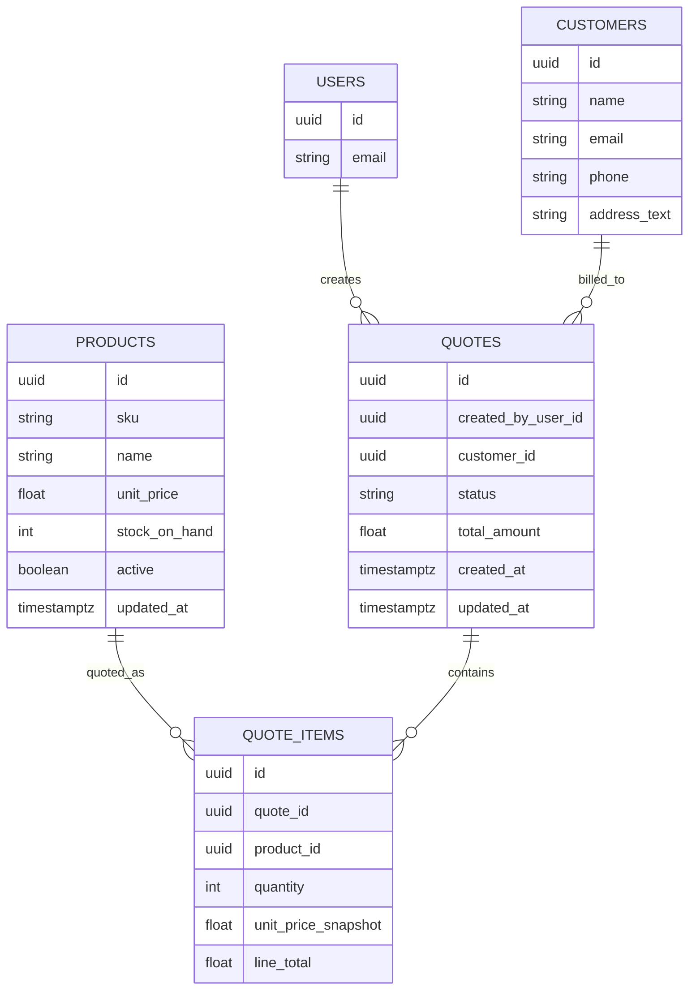

## 1.Architecture design


## 2.Technology Description
- Frontend: Quasar Framework (Vue@3) + TypeScript + Pinia (state) + Vue Router
- Backend: Supabase (Auth + PostgreSQL + Storage) via supabase-js
- PDF generation: Client-side (pdf-lib or pdfmake) for download; optional upload to Supabase Storage
- Current status: Supabase is connected (Auth/DB/Storage reachable in the app runtime)

## 3.Route definitions
| Route | Purpose |
|-------|---------|
| /login | Authenticate users |
| /quotes | Quotes dashboard (list, filter, create) |
| /quotes/:id | Quote editor/detail (items, status, PDF export) |
| /inventory | Inventory management (products, stock on hand) |
| /customers | Customer management |

## 6.Data model(if applicable)

### 6.1 Data model definition


### 6.2 Data Definition Language
Users are handled by Supabase Auth; app tables reference `auth.users.id` logically (no physical FK).

Products (products)
```
CREATE TABLE products (
  id UUID PRIMARY KEY DEFAULT gen_random_uuid(),
  sku TEXT UNIQUE NOT NULL,
  name TEXT NOT NULL,
  unit_price NUMERIC(12,2) NOT NULL,
  stock_on_hand INTEGER NOT NULL DEFAULT 0,
  active BOOLEAN NOT NULL DEFAULT TRUE,
  updated_at TIMESTAMPTZ NOT NULL DEFAULT NOW()
);
GRANT SELECT ON products TO anon;
GRANT ALL PRIVILEGES ON products TO authenticated;
```
Customers (customers)
```
CREATE TABLE customers (
  id UUID PRIMARY KEY DEFAULT gen_random_uuid(),
  name TEXT NOT NULL,
  email TEXT,
  phone TEXT,
  address_text TEXT
);
GRANT ALL PRIVILEGES ON customers TO authenticated;
```
Quotes (quotes) + Items (quote_items)
```
CREATE TABLE quotes (
  id UUID PRIMARY KEY DEFAULT gen_random_uuid(),
  created_by_user_id UUID NOT NULL,
  customer_id UUID NOT NULL,
  status TEXT NOT NULL DEFAULT 'draft',
  total_amount NUMERIC(12,2) NOT NULL DEFAULT 0,
  created_at TIMESTAMPTZ NOT NULL DEFAULT NOW(),
  updated_at TIMESTAMPTZ NOT NULL DEFAULT NOW()
);
CREATE TABLE quote_items (
  id UUID PRIMARY KEY DEFAULT gen_random_uuid(),
  quote_id UUID NOT NULL,
  product_id UUID NOT NULL,
  quantity INTEGER NOT NULL,
  unit_price_snapshot NUMERIC(12,2) NOT NULL,
  line_total NUMERIC(12,2) NOT NULL
);
GRANT ALL PRIVILEGES ON quotes TO authenticated;
GRANT ALL PRIVILEGES ON quote_items TO authenticated;
```
Stock warning rules (stock_rules)
```
CREATE TABLE stock_rules (
  id UUID PRIMARY KEY DEFAULT gen_random_uuid(),
  mode TEXT NOT NULL DEFAULT 'block_on_send',
  updated_at TIMESTAMPTZ NOT NULL DEFAULT NOW()
);
GRANT ALL PRIVILEGES ON stock_rules TO authenticated;
```
Notes:
- Stock warnings are calculated in the frontend by comparing `quote_items.quantity` with `products.stock_on_hand`.
- Enforce "inventory-only" by never providing inputs for free-text product name/price; always use `product_id` and snapshot price at add-time.
- Build-ready RLS and role model are defined in section 6.3.

### 6.3 RLS policies (build-ready)
Enable RLS on all app tables and use a simple `user_roles` table to distinguish Admin vs Sales. (No physical FK constraints.)

User roles (user_roles)
```
CREATE TABLE user_roles (
  id UUID PRIMARY KEY DEFAULT gen_random_uuid(),
  user_id UUID NOT NULL,
  role TEXT NOT NULL CHECK (role IN ('admin','sales')),
  created_at TIMESTAMPTZ NOT NULL DEFAULT NOW()
);
GRANT ALL PRIVILEGES ON user_roles TO authenticated;

ALTER TABLE user_roles ENABLE ROW LEVEL SECURITY;
CREATE POLICY "user_roles_read_self_or_admin" ON user_roles
  FOR SELECT TO authenticated
  USING (user_id = auth.uid() OR EXISTS (
    SELECT 1 FROM user_roles ur WHERE ur.user_id = auth.uid() AND ur.role = 'admin'
  ));
CREATE POLICY "user_roles_admin_write" ON user_roles
  FOR ALL TO authenticated
  USING (EXISTS (SELECT 1 FROM user_roles ur WHERE ur.user_id = auth.uid() AND ur.role = 'admin'))
  WITH CHECK (EXISTS (SELECT 1 FROM user_roles ur WHERE ur.user_id = auth.uid() AND ur.role = 'admin'));
```

Core table RLS (examples)
```
-- Products: all signed-in can read; only admin can write
ALTER TABLE products ENABLE ROW LEVEL SECURITY;
CREATE POLICY "products_read" ON products FOR SELECT TO authenticated USING (true);
CREATE POLICY "products_admin_write" ON products FOR ALL TO authenticated
  USING (EXISTS (SELECT 1 FROM user_roles ur WHERE ur.user_id = auth.uid() AND ur.role = 'admin'))
  WITH CHECK (EXISTS (SELECT 1 FROM user_roles ur WHERE ur.user_id = auth.uid() AND ur.role = 'admin'));

-- Customers: all signed-in can read (for selection); only admin can write
ALTER TABLE customers ENABLE ROW LEVEL SECURITY;
CREATE POLICY "customers_read" ON customers FOR SELECT TO authenticated USING (true);
CREATE POLICY "customers_admin_write" ON customers FOR ALL TO authenticated
  USING (EXISTS (SELECT 1 FROM user_roles ur WHERE ur.user_id = auth.uid() AND ur.role = 'admin'))
  WITH CHECK (EXISTS (SELECT 1 FROM user_roles ur WHERE ur.user_id = auth.uid() AND ur.role = 'admin'));

-- Quotes: sales can CRUD their own; admin can access all
ALTER TABLE quotes ENABLE ROW LEVEL SECURITY;
CREATE POLICY "quotes_read" ON quotes FOR SELECT TO authenticated
  USING (created_by_user_id = auth.uid() OR EXISTS (
    SELECT 1 FROM user_roles ur WHERE ur.user_id = auth.uid() AND ur.role = 'admin'
  ));
CREATE POLICY "quotes_insert" ON quotes FOR INSERT TO authenticated
  WITH CHECK (created_by_user_id = auth.uid() OR EXISTS (
    SELECT 1 FROM user_roles ur WHERE ur.user_id = auth.uid() AND ur.role = 'admin'
  ));
CREATE POLICY "quotes_update" ON quotes FOR UPDATE TO authenticated
  USING (created_by_user_id = auth.uid() OR EXISTS (SELECT 1 FROM user_roles ur WHERE ur.user_id = auth.uid() AND ur.role = 'admin'))
  WITH CHECK (created_by_user_id = auth.uid() OR EXISTS (SELECT 1 FROM user_roles ur WHERE ur.user_id = auth.uid() AND ur.role = 'admin'));
CREATE POLICY "quotes_delete" ON quotes FOR DELETE TO authenticated
  USING (created_by_user_id = auth.uid() OR EXISTS (SELECT 1 FROM user_roles ur WHERE ur.user_id = auth.uid() AND ur.role = 'admin'));

-- Quote items: access controlled via owning quote
ALTER TABLE quote_items ENABLE ROW LEVEL SECURITY;
CREATE POLICY "quote_items_read" ON quote_items FOR SELECT TO authenticated
  USING (EXISTS (
    SELECT 1 FROM quotes q
    WHERE q.id = quote_items.quote_id
      AND (q.created_by_user_id = auth.uid() OR EXISTS (SELECT 1 FROM user_roles ur WHERE ur.user_id = auth.uid() AND ur.role = 'admin'))
  ));
CREATE POLICY "quote_items_write" ON quote_items FOR ALL TO authenticated
  USING (EXISTS (
    SELECT 1 FROM quotes q
    WHERE q.id = quote_items.quote_id
      AND (q.created_by_user_id = auth.uid() OR EXISTS (SELECT 1 FROM user_roles ur WHERE ur.user_id = auth.uid() AND ur.role = 'admin'))
  ))
  WITH CHECK (EXISTS (
    SELECT 1 FROM quotes q
    WHERE q.id = quote_items.quote_id
      AND (q.created_by_user_id = auth.uid() OR EXISTS (SELECT 1 FROM user_roles ur WHERE ur.user_id = auth.uid() AND ur.role = 'admin'))
  ));

-- Stock rules: readable by all signed-in; writable by admin
ALTER TABLE stock_rules ENABLE ROW LEVEL SECURITY;
CREATE POLICY "stock_rules_read" ON stock_rules FOR SELECT TO authenticated USING (true);
CREATE POLICY "stock_rules_admin_write" ON stock_rules FOR ALL TO authenticated
  USING (EXISTS (SELECT 1 FROM user_roles ur WHERE ur.user_id = auth.uid() AND ur.role = 'admin'))
  WITH CHECK (EXISTS (SELECT 1 FROM user_roles ur WHERE ur.user_id = auth.uid() AND ur.role = 'admin'));
```

Supabase Storage (optional, for PDF uploads)
- Create bucket: `quote-pdfs` (private).
- Store objects under: `quotes/{quote_id}/quote-{quote_id}-{timestamp}.pdf`.
- Add `quotes.pdf_object_path` (TEXT, nullable) if you want to persist the latest uploaded PDF path.

## 7. Build-ready implementation checklist
### 7.1 Frontend routes & guards
- [ ] `/login`: Supabase email/password sign-in + password reset.
- [ ] Global auth guard: redirect unauthenticated users to `/login`; keep session refreshed.
- [ ] `/quotes`: list + filters + “New Quote” creates draft quote row then routes to `/quotes/:id`.
- [ ] `/quotes/:id`: loads quote + items + customer; saves edits; controls status transitions; triggers PDF export.
- [ ] `/inventory`: products CRUD (admin-only write UI); sales read-only.
- [ ] `/customers`: customers CRUD (admin-only write UI); sales read-only.

### 7.2 Database tables & seed data
- [ ] Create tables: `products`, `customers`, `quotes`, `quote_items`, `stock_rules`, `user_roles`.
- [ ] Seed `stock_rules` with one row (e.g., `mode='block_on_send'`).
- [ ] Ensure `quotes.created_by_user_id` is set to `auth.uid()` on insert from the client.

### 7.3 RLS + grants
- [ ] Run `GRANT ... TO authenticated` for all app tables.
- [ ] `ALTER TABLE ... ENABLE ROW LEVEL SECURITY` on all app tables.
- [ ] Apply policies from section 6.3 (or equivalent), ensuring:
  - [ ] Sales can only access their own quotes/items.
  - [ ] Admin can manage inventory/customers/users/stock rules.

### 7.4 PDF export (download + optional upload)
- [ ] Generate PDF from Quote Detail using a deterministic template:
  - [ ] Includes quote id, customer block, line items, totals, status label + timestamp.
  - [ ] “Download PDF” always available.
  - [ ] “Final PDF Export” (or “Mark as Sent”) blocked when stock rule fails.
- [ ] (Optional) Upload exported PDF to Storage bucket `quote-pdfs` and persist `pdf_object_path` on the quote.